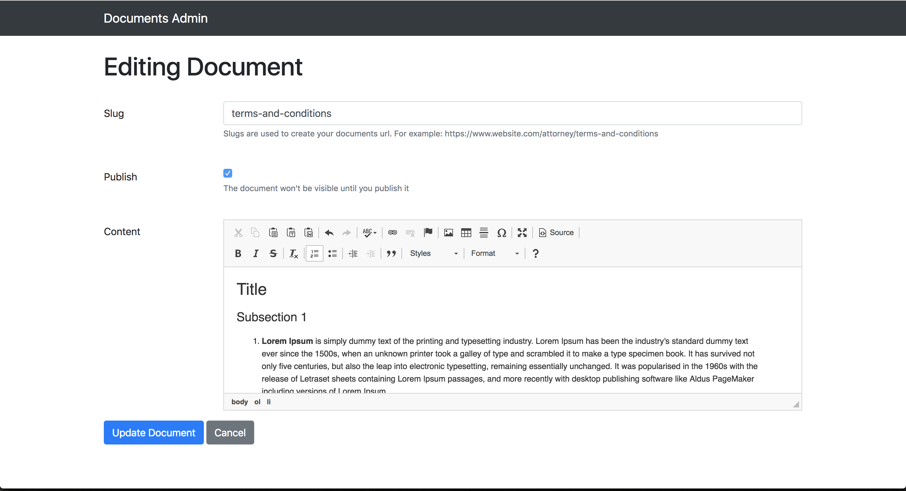

# Attorney

[](https://travis-ci.org/cedarcode/attorney)
[](https://codeclimate.com/github/cedarcode/attorney)
[](https://badge.fury.io/rb/attorney)

Easily define and mount `Terms of Service`, `Privacy Policy` and
 any other static page to your Rails app.


## Installation
Add this line to your application's Gemfile:

```ruby
gem 'attorney'
```

And then execute:
```bash
$ bundle
```

Or install it yourself as:
```bash
$ gem install attorney
```

## Usage
#### Mounting the engine
First, mount the engine like any normal [Rails engine](http://guides.rubyonrails.org/engines.html#mounting-the-engine).
 In `config/routes.rb`:

```ruby
Rails.application.routes.draw do
  mount Attorney::Engine => '/legal'
end
```
This will add all the routes coming from the gem appended to the
 `/legal` path. Keep in mind that you can rename this anyway you want
 in your app, not necessarily `/legal`.

#### Installing migrations
Now, you will need to install the migrations by running the
 following command:
```bash
$ bin/rails attorney:install:migrations
```

This will copy a migration file to your application. When ran,
 the migration will create a table named `attorney_documents`
 which is where all your Attorney related content will be stored.

### Admin section
Attorney comes with a simple admin section for managing your
 documents. The admin section uses a simple HTTP Auth for
 authorizing users. You should create two `ENV` variables for
 setting the credentials:

```ruby
ATTORNEY_HTTP_AUTH_NAME
ATTORNEY_HTTP_AUTH_PASSWORD
```

By default, auth name will be `attorney` and password will be
 `secret`. Please make sure to change those in production.

### Creating documents
After running the migrations, you should be ready to start creating
 your first documents. Start your server and navigate to
 `/legal/admin/documents`. You should see a basic CRUD for creating
 `documents`. Just follow the steps and start creating your docs.

#### Slugs
When you create your first document, you'll notice that there's a
 `slug` field in the form. A [slug](https://en.wikipedia.org/wiki/Slug_(publishing))
 is no more than a short human friendly name that serves as an
 identifier for your documents.

For example, if you have a `Terms and conditions` document, it might
 make sense to use a slug named `terms-and-conditions`. This will
 later be used to construct the URL that your users will have
 access to, like `/lega/terms-and-conditions`.

#### Rich Editor
Attorney relies on [CKEditor 4](https://ckeditor.com/ckeditor-4/#article)
 to provide a great Rich Editor for your document's content. This
 is a very flexible editor which will allow you to add titles,
 headings, bullet points and more. Check the examples in the link
 above to see what it is capable of.

Here's a sample image of the Attorney editor:


### Publishing documents
You just need to check the `publish` checkbox and your document will
 be publicly accessible.

Every document is accessible through it's slugged URL. For example,
 if you have a `terms-and-conditions` document, then you should be
 able to see it by going to `/legal/terms-and-conditions` in
 your website. It's really as simple as that.

### Configuring layout
Attorney will attempt to use the `application` layout as
 default for displaying documents. If you need to use a different
 layout you can do it by adding the following configuration in
  `config/initializers/attorney.rb`:

```ruby
Attorney.application_layout = 'your_own_layout'
```

## Contributing

1. Fork it ( https://github.com/cedarcode/attorney/ )
2. Create your feature branch (`git checkout -b my-new-feature`)
3. Commit your changes (`git commit -am 'Add some feature'`)
4. Push to the branch (`git push origin my-new-feature`)
5. Create a new Pull Request

See the [Running Tests](RUNNING_TESTS.md) guide for details on how to run the test suite.

## License

This project is licensed under the Mozilla Public License 2.0 - see the [LICENSE](LICENSE) file for details.
